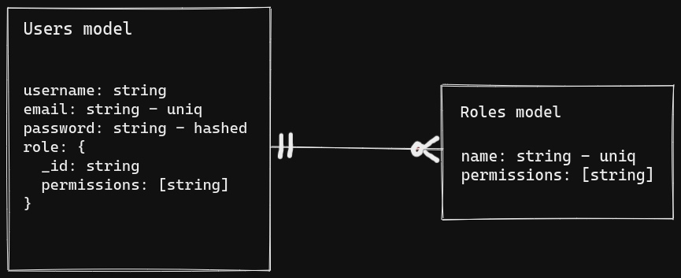

# Authentication and Authorization system
## Description
### Use cases
- Sign up and authenticating users
- Log users out from the system
- Adding permissions
- Adding roles with certain permissions
- Updating roles permissions
- Adding actions with certain permissions
- Assigning role to certain user 
- Validating whether logged user is permitted to do specific action or not

### Considerations
Here is the points that first come to my mind after some thinking and searching and you will find some resources that will help you to take a decision.
- Sessions vs. Jwt
- MongoDB vs Redis for storing user sessions
- Best way to maintain user session
- express-session & passport session

For me I decided to:
- Use jwt for user authentication as It is simple and easier to implement.
- To save jwt in the users collection to log the user out by deleting it.

## How to run

### With docker
1. Just install docker
1. Run `npm run docker` in the root folder
1. init `.env` file and please note that if you will use a local db, it should be something like this `mongodb://mongo:27017/user-auth-system`

### Without docker
#### Requirements
- Mongo server installed
- Node js installed

#### Setups
just run `npm i`, add `.env` file ... then `npm start` and here you go.

## Technical
### Integrated tools/packages
- Eslint: for better coding style all over the project
- Jest: for testing purposes
- Swagger: for exposed APIs docs
- Docker: to run regardless the environment 

## Project details
### ER diagram
I wanted the authorization to be extendible ... not dependant on actions implemented in the code.
This design will allow the user to add as many actions as he like and assign their permissions to roles and users also easily.

Permissions are denormalized in users schema here as the authorize will be used in real systems more than updating a role/action permissions

### Work flow
- Running the project for the first time will seed the database with basic roles, permissions and admin user ... throw these seeds you can execute any endpoint that need admin to call it (add new role/permission/action)

- If it is not the first time to run it, everything will be as it is ... it will only the missing seeds.

- Setting admin mail and password in the `.env` file, will create an admin with these data on the startup and if there is already admin with the provided mail, it will reset his password with the provided password.

### APIs
- After running the project you can find the endpoint docs at `localhost:<port-number>/docs`

## Future work
- Integrating jsDocs also will be better.
- Seeding basic actions to the system on project startup.
- Adding endpoints to facilitate the work flow:
  - delete role
  - update action permissions
  - listing roles with their permissions
  - listing actions with their permissions
  - listing user with his permissions
- Implement the same logic with sessions

## Useful links
- https://developer.okta.com/blog/2021/06/07/session-mgmt-node
- https://blog.jscrambler.com/best-practices-for-secure-session-management-in-node
- https://stackoverflow.com/questions/27010013/express-session-vs-passportjs-session
- https://www.airpair.com/express/posts/expressjs-and-passportjs-sessions-deep-dive
